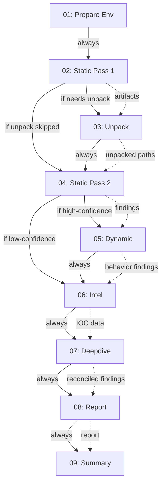

# Stage Dependencies and Handoffs

## Dependency Graph

The 9-stage pipeline has conditional dependencies and mandatory handoffs:



## Handoff Contracts

### 01 → 02: Prepare Env → Static Pass 1

**Handoff**:
- ✅ Environment validation complete
- ✅ All tools verified available
- ✅ Staging directory ready

**Input to 02**:
- Sample file path (verified readable)
- Analysis directory path

**Exit Conditions**:
- ✅ `recommend_next_stage: run_next` — Environment OK, proceed to static pass 1
- ❌ `recommend_next_stage: retry_stage` — Environment issue; manual review needed

### 02 → 03 or 04: Static Pass 1 → Unpack or Static Pass 2

**Decision Logic** (in 02-static-pass1):
```python
def decide_unpack(findings: List[Finding]) -> bool:
    """Determine if unpack stage should run."""
    for finding in findings:
        if finding.category == "obfuscation":
            if finding.packer in ["UPX", "ASPack", "PyInstaller"]:
                return True
    return False
```

**If Unpack Needed (→ 03)**:
- Output artifact paths and SHA256
- Indicate which unpacking methods to try
- `recommend_next_stage: run_next`

**If No Unpack Needed (→ 04)**:
- Skip stage 03 entirely
- `recommend_next_stage: run_next` (will skip 03 and run 04)

**Handoff Contract**:
- ✅ File type identified (NATIVE, DOTNET, PYTHON_SCRIPT)
- ✅ DIE header info extracted
- ✅ Initial findings produced
- ✅ Artifact registry populated with primary sample

### 03 → 04: Unpack → Static Pass 2

**Handoff Contract**:
- ✅ Unpacked artifact paths recorded
- ✅ Parent/child relationships established
- ✅ SHA256 of each unpacked artifact calculated
- ✅ Extraction method and limitations documented (e.g., "partial extraction, OEP uncertain")
- ✅ New artifacts added to registry

**Output Schema** (03-unpack.json):
```json
{
  "unpacked_artifacts": [
    {
      "artifact_id": "art_0002",
      "path": "/analysis/extracted/payload.dll",
      "sha256": "new_hash",
      "parent_artifact_id": "art_0001",
      "extraction_method": "upx",
      "limitations": "OEP may not be precise"
    }
  ]
}
```

**Consumed by 04**:
- For each unpacked artifact, perform static analysis
- Reference parent lineage in findings
- Consolidate findings from pass 1 and pass 2

### 04 → 05/06: Static Pass 2 → Dynamic or Intel

**Decision Logic** (in 04-static-pass2):
```python
def should_run_dynamic(findings: List[Finding]) -> bool:
    """Determine if dynamic analysis adds value."""
    high_confidence = [f for f in findings if f.severity in ["critical", "high"]]
    
    # Run dynamic if findings are incomplete or inconclusive
    return len(high_confidence) < 3 or any(
        f.category == "capability" for f in high_confidence
    )
```

**If Dynamic Needed (→ 05)**:
- `recommend_next_stage: run_next` 
- Pass findings and artifacts to dynamic analyzer

**If Low Confidence (→ 06)**:
- Skip dynamic, proceed to intel enrichment
- `recommend_next_stage: run_next`

**Handoff**:
- ✅ Consolidated findings from both static passes
- ✅ Complete artifact registry (all unpacked items)
- ✅ High-confidence obfuscation and config findings

### 05 → 06: Dynamic → Intel

**Handoff Contract**:
- ✅ Captured network traffic (if any)
- ✅ File system modifications (if any)
- ✅ Process injection attempts (if any)
- ✅ Behavioral findings extracted
- ✅ Memory dumps (if relevant anomalies found)

**Input to 06**:
- Behavioral findings from dynamic analysis
- Sample hashes (primary + unpacked)
- IOC candidates (IPs, domains extracted from strings/memory)

### 06 → 07: Intel → Deepdive

**Handoff Contract**:
- ✅ VirusTotal reputation data (if available)
- ✅ External IOC enrichment (IPs, domains, URLs)
- ✅ False-positive flags (if any)
- ✅ Consolidated IOC list with sources

**Input to 07**:
- All prior findings (static, dynamic, intel)
- Artifact registry (complete lineage)
- IOC data with confidence scores

### 07 → 08: Deepdive → Report

**Handoff Contract**:
- ✅ Conflicting claims identified and resolved
- ✅ Findings ranked by confidence
- ✅ Capability map constructed (exfiltration, evasion, persistence, etc.)
- ✅ Evidence chains validated

**Output** (07-deepdive.json):
```json
{
  "reconciliation_results": [
    {
      "conflicting_claims": ["Finding A says benign", "Finding B says malicious"],
      "resolution": "Finding B is more reliable (dynamic evidence > static heuristic)"
    }
  ],
  "capability_map": {
    "exfiltration": {
      "confidence": 0.95,
      "evidence": [
        "dynamic: network connection to C&C",
        "static: data compression function"
      ]
    }
  }
}
```

**Input to 08**:
- All reconciled findings
- Capability map
- IOC list with context

### 08 → 09: Report → Summary

**Handoff Contract**:
- ✅ Markdown report generated
- ✅ Executive summary (1-2 sentences)
- ✅ All findings included with context
- ✅ IOC extraction formatted
- ✅ Capability visualization provided

**Input to 09**:
- Synthesized report (08-report.md)
- All structured findings
- Capability map and evidence chains

### 09 (Final): Summary

**Output** (09-summary.json):
```json
{
  "verdict": "malicious",
  "risk_score": 92,
  "confidence": 0.96,
  "key_findings": [/* top 3-5 findings */],
  "reasoning": "Sample exhibits botnet command & control communication..."
}
```

**This is the final stage**; no further stages follow.

## Conditional Execution Logic

### Unpack Stage Skipping

Stage 03 (unpack) is skipped if:
- No packers detected
- Packer is unsupported (e.g., custom packer)
- Prior unpack attempt failed

```python
# In 02-static-pass1
unpack_needed = detect_packer(die_output)
if unpack_needed:
    recommend_next_stage = "run_next"  # Will execute 03
else:
    recommend_next_stage = "run_next"  # Will skip 03, execute 04
```

Orchestrator honors the recommendation and skips stage 03 if not needed.

### Dynamic Analysis Skipping

Stage 05 (dynamic) may be skipped if:
- Static analysis is high-confidence benign
- Sample is known malware (VirusTotal rating available)
- Environmental constraints (no VMware, no guest VM)

```python
# In 04-static-pass2
if confidence_malicious > 0.9:
    recommend_next_stage = "run_next"  # Execute dynamic for confirmation
elif confidence_benign > 0.9:
    recommend_next_stage = "run_next"  # Skip dynamic, go to intel
```

### Intel Stage Skipping

Stage 06 (intel) is skipped if:
- VirusTotal API key not configured
- Sample not found in VirusTotal
- No network-based IOC to enrich

## Artifact Lineage

Artifacts form a directed acyclic graph (DAG) of parent/child relationships:

```
art_0000 (original sample)
├── art_0001 (unpacked via UPX)
│   ├── art_0002 (injected DLL)
│   └── art_0003 (memory dump)
└── art_0004 (config extracted)
```

Each finding references a specific artifact:
- "Finding A" → art_0001 (unpacked DLL)
- "Finding B" → art_0002 (injected DLL)
- "Finding C" → art_0004 (config)

During report synthesis (stage 08), findings are grouped by artifact and context is provided.

## Progress Checkpointing

When a stage reaches 80% context usage:

1. Stage saves progress to `_state/{STAGE_ID}.progress.md`
2. Progress file includes:
   - Current execution phase
   - Artifacts processed so far
   - Intermediate findings
   - Next steps to resume
3. Stage sets `status: running` in STATE.json
4. Orchestrator resumes from progress file on next invocation

Example progress file:
```markdown
# Stage 05-dynamic Progress Checkpoint

## Execution Phase
Resume from: network_traffic_capture

## Artifacts Processed So Far
- art_0001: native.exe (behavioral findings extracted)
- art_0002: payload.dll (injection attempts recorded)

## Intermediate Findings
- Process injection into svchost.exe detected
- Network connection to 192.168.1.1:8080 recorded
- File write to C:\Windows\temp detected

## Next Steps
1. Continue network traffic analysis
2. Extract memory dumps
3. Consolidate findings
```

## Cross-Stage Validation

Before accepting a stage's output:

1. **Schema Validation**: Artifact JSON matches schema.json
2. **Artifact Reference Validation**: All artifact_id in findings point to known artifacts
3. **Lineage Validation**: Parent artifact IDs exist and form valid DAG
4. **Severity Consistency**: Findings have valid severity levels
5. **Category Consistency**: Finding categories are recognized

Invalid artifacts cause stage failure; operator must investigate or retry.

## State Drift Detection

If STATE.json becomes inconsistent:
- Missing expected stages
- Unexpected stage ordering
- Status regression (completed → pending)
- Recommend_next_stage logic violated

The orchestrator detects and reports drifts; hyperagent-progress marks run as "drifted".

## Related Documentation

- [Pipeline Details](./pipeline.md) — Stage-by-stage breakdown
- [Architecture Overview](./overview.md) — System design
- [Orchestrator](../orchestration/launcher.md) — Stage execution loop
- [State Management](../orchestration/state-management.md) — STATE.json contract

