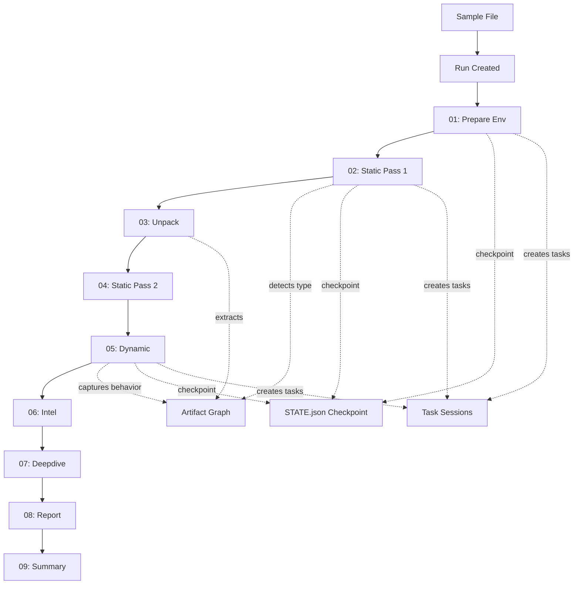

# HyperAgent Quick Start

HyperAgent is a sophisticated multi-stage malware-analysis orchestrator that sequences 9 pipeline stages, each backed by Claude Code skills, to comprehensively analyze suspicious samples (native binaries, .NET assemblies, Python bytecode).

## Core Concepts

| Concept | Definition |
|---------|-----------|
| **Run** | A complete analysis session for a single sample file. Produces compatibility-projection public response. |
| **Task Session** | A traceable work unit within a run (identify, route, agent analysis, etc.). Enables live observability. |
| **Artifact** | A file or directory discovered during analysis. Maintains lineage (parent/child relationships) to form artifact graph. |
| **Finding** | Normalized analysis result bound to an artifact (behavior, obfuscation, config, IOC, capability, anomaly). |
| **Skill** | Claude Code interface with SKILL.md orchestration; each pipeline stage is powered by a skill. |
| **Stage** | Named pipeline phase (01-prepare-env through 09-summary) with explicit entry/exit conditions. |

## System Overview

```
Sample → [Run Created] → Identify → Route → Static Pass 1 → Unpack → Static Pass 2 → 
Dynamic → Intel → Deepdive → Report → Risk Score → [Run Complete + Task Snapshots]
```

### The 9 Pipeline Stages

| # | Stage | Skill | Purpose |
|---|-------|-------|---------|
| 01 | prepare-env | hyperagent-prepare-env | Verify environment readiness and tool availability |
| 02 | static-pass1 | hyperagent-static | Identify file type, route to coarse agent, perform initial analysis |
| 03 | unpack | hyperagent-unpack | Extract and decompose payloads (UPX, PyInstaller, .NET binaries) |
| 04 | static-pass2 | hyperagent-static | Analyze unpacked artifacts, refine findings |
| 05 | dynamic | hyperagent-dynamic | Runtime behavior capture via debugger/VM |
| 06 | intel | hyperagent-intel | External reputation and IOC enrichment (VirusTotal) |
| 07 | deepdive | hyperagent-deepdive | Targeted deep analysis based on confidence and evidence reconciliation |
| 08 | report | hyperagent-report | Synthesize findings into structured markdown report |
| 09 | summary | hyperagent-summary | Assign final verdict and risk score (0-100) |

### Key Architecture Patterns

- **Artifact Graph**: Unpacked payloads and nested artifacts maintain parent/child relationships, enabling multi-level analysis.
- **State Checkpointing**: When a stage reaches 80% context usage, it checkpoints to a progress file and exits. The launcher automatically resumes it.
- **Injection Guard**: Stages that read sample-derived content (strings, disassembly, traffic) are wrapped with an anti-prompt-injection guard to prevent sample tampering.
- **Task Observability**: Every work unit (task session) is traceable for live dashboards and operator observability.

## Main Entry Points

### Analysis Launcher (Operators)
- **`python claude_spawn.py <file>`** — Launch analysis of a single sample
- **`python claude_spawn.py --batch <file_list>`** — Batch process multiple files
- See [Launcher documentation](./orchestration/launcher.md)

### Pipeline Controller (Operators)
- **`claude -p '/hyperagent-progress'`** — Discover ongoing runs, classify (finished/resumable/drifted), and auto-resume
- See [Pipeline Controller documentation](./orchestration/pipeline-controller.md)

### HTTP API (Programmatic)
- **`POST /analyze/path`** — Analyze file from filesystem path
- **`POST /analyze/upload`** — Upload and analyze file
- See [REST API documentation](./api/rest-api.md)

## Key Systems and Navigation

### **Orchestration & Pipeline Execution**
- [Launcher (claude_spawn.py)](./orchestration/launcher.md) — Main orchestrator and stage sequencer
- [State Management (STATE.json, pipeline_state.py)](./orchestration/state-management.md) — Canonical state contract
- [Execution Model](./orchestration/execution-model.md) — Environment variables, context monitoring, artifact validation
- [Pipeline Controller (hyperagent-progress)](./orchestration/pipeline-controller.md) — Operator run discovery and resumption
- [Error Recovery](./orchestration/error-recovery.md) — Failure states, MAX_STAGE_ATTEMPTS, partial completion, manual recovery

### **Architecture & Design**
- [System Overview](./architecture/overview.md) — Artifact-graph orchestrator, pipeline model, runtime execution
- [Pipeline Details](./architecture/pipeline.md) — Stage breakdown, state contract, checkpointing, injection guard
- [Stage Dependencies](./architecture/stage-dependencies.md) — Conditional execution, handoff contracts, cross-stage validation
- [Data Models](./architecture/data-models.md) — TaskSession, RunContext, ArtifactNode, Finding, etc.
<!-- openwiki: broken internal link [./architecture/task-observability.md] file "./architecture/task-observability.md" does not exist. Fix the href or restore the target, then delete this comment. -->
- [Task Observability](./architecture/task-observability.md) — Live task snapshots, board/timeline projections

### **Agents & File Type Handling**
- [Agent Overview](./agents/overview.md) — Taxonomy and routing logic
- [Coarse Agents](./agents/coarse-agents.md) — NativeAgent (PE), ScriptAgent (Python), DotNetAgent (.NET)
- [Routing & Dispatch](./agents/routing-and-dispatch.md) — DIE integration, agent selection, static-pass1 composition

### **Skills & Stages**
- [Skills Overview](./skills/overview.md) — Skill system, compatibility model, SKILL.md orchestration
<!-- openwiki: broken internal link [./skills/stages/01-prepare-env.md] file "./skills/stages/01-prepare-env.md" does not exist. Fix the href or restore the target, then delete this comment. -->
- [01 Prepare Env](./skills/stages/01-prepare-env.md) — Environment validation
- [02/04 Static Analysis](./skills/stages/02-04-static-analysis.md) — File identification, routing, unpacking
- [03 Unpack](./skills/stages/02-04-static-analysis.md) — Payload extraction (cross-section)
- [05 Dynamic](./skills/stages/05-dynamic-analysis.md) — Runtime behavior capture (x64dbg, VMware)
<!-- openwiki: broken internal link [./skills/stages/06-intel.md] file "./skills/stages/06-intel.md" does not exist. Fix the href or restore the target, then delete this comment. -->
- [06 Intel](./skills/stages/06-intel.md) — External enrichment (VirusTotal)
<!-- openwiki: broken internal link [./skills/stages/07-deepdive.md] file "./skills/stages/07-deepdive.md" does not exist. Fix the href or restore the target, then delete this comment. -->
- [07 Deepdive](./skills/stages/07-deepdive.md) — Evidence reconciliation
<!-- openwiki: broken internal link [./skills/stages/08-report.md] file "./skills/stages/08-report.md" does not exist. Fix the href or restore the target, then delete this comment. -->
- [08 Report](./skills/stages/08-report.md) — Report synthesis
<!-- openwiki: broken internal link [./skills/stages/09-summary.md] file "./skills/stages/09-summary.md" does not exist. Fix the href or restore the target, then delete this comment. -->
- [09 Summary](./skills/stages/09-summary.md) — Verdict assignment

### **Data & Contracts**
<!-- openwiki: broken internal link [./data/schemas.md] file "./data/schemas.md" does not exist. Fix the href or restore the target, then delete this comment. -->
- [Schemas (STATE.json, per-stage)](./data/schemas.md) — Schema structure, versioning, extension
- [Response Contract](./data/response-contract.md) — Public envelope, backward compatibility
- [Artifacts](./data/artifacts.md) — ArtifactNode, lineage, deduplication
- [Findings](./data/findings.md) — Finding model, categories, severity, evidence

### **Integration & External Tools**
<!-- openwiki: broken internal link [./integration/mcp-protocol.md] file "./integration/mcp-protocol.md" does not exist. Fix the href or restore the target, then delete this comment. -->
- [MCP Protocol Overview](./integration/mcp-protocol.md) — Model Context Protocol and Claude Code server communication
<!-- openwiki: broken internal link [./integration/ida-pro-mcp.md] file "./integration/ida-pro-mcp.md" does not exist. Fix the href or restore the target, then delete this comment. -->
- [IDA Pro MCP](./integration/ida-pro-mcp.md) — Plugin syntax, available tools
<!-- openwiki: broken internal link [./integration/x64dbg-mcp.md] file "./integration/x64dbg-mcp.md" does not exist. Fix the href or restore the target, then delete this comment. -->
- [x64dbg MCP](./integration/x64dbg-mcp.md) — Debugger tool reference
<!-- openwiki: broken internal link [./integration/vmware.md] file "./integration/vmware.md" does not exist. Fix the href or restore the target, then delete this comment. -->
- [VMware Integration](./integration/vmware.md) — Guest execution and process monitoring
<!-- openwiki: broken internal link [./integration/die.md] file "./integration/die.md" does not exist. Fix the href or restore the target, then delete this comment. -->
- [DIE (Detect It Easy)](./integration/die.md) — File type detection
<!-- openwiki: broken internal link [./integration/virustotal.md] file "./integration/virustotal.md" does not exist. Fix the href or restore the target, then delete this comment. -->
- [VirusTotal API](./integration/virustotal.md) — Reputation queries, IOC enrichment

### **Setup & Configuration**
- [Environment Setup](./setup/environment-setup.md) — Bootstrap, prerequisites, MCP server setup, validation
<!-- openwiki: broken internal link [./setup/configuration.md] file "./setup/configuration.md" does not exist. Fix the href or restore the target, then delete this comment. -->
- [Configuration](./setup/configuration.md) — config.yaml, environment variables, precedence, tool discovery

### **Testing & Validation**
<!-- openwiki: broken internal link [./testing/strategy.md] file "./testing/strategy.md" does not exist. Fix the href or restore the target, then delete this comment. -->
- [Testing Strategy](./testing/strategy.md) — Unit, integration, end-to-end tests, fixtures, coverage
<!-- openwiki: broken internal link [./testing/validation.md] file "./testing/validation.md" does not exist. Fix the href or restore the target, then delete this comment. -->
- [Validation Tools](./testing/validation.md) — validate_output.py, schema validation, exit codes
<!-- openwiki: broken internal link [./testing/pipeline-validation.md] file "./testing/pipeline-validation.md" does not exist. Fix the href or restore the target, then delete this comment. -->
- [Pipeline Validation](./testing/pipeline-validation.md) — validate_pipeline.py, consistency checks
<!-- openwiki: broken internal link [./testing/test-fixtures.md] file "./testing/test-fixtures.md" does not exist. Fix the href or restore the target, then delete this comment. -->
- [Test Fixtures](./testing/test-fixtures.md) — Sample data, provenance, expected outputs

### **Utilities & Helpers**
<!-- openwiki: broken internal link [./utilities/helpers.md] file "./utilities/helpers.md" does not exist. Fix the href or restore the target, then delete this comment. -->
- [Helper Functions](./utilities/helpers.md) — sha256_of, stage_schema_path, artifact_is_valid, validate_pipeline, etc.
<!-- openwiki: broken internal link [./utilities/error-tags.md] file "./utilities/error-tags.md" does not exist. Fix the href or restore the target, then delete this comment. -->
- [Error Tags](./utilities/error-tags.md) — Tagging conventions, environment failure detection

### **Workflows & Change Recipes**
<!-- openwiki: broken internal link [./workflows/add-skill.md] file "./workflows/add-skill.md" does not exist. Fix the href or restore the target, then delete this comment. -->
- [Add a Skill](./workflows/add-skill.md) — Creating new analysis skills
<!-- openwiki: broken internal link [./workflows/extend-pipeline.md] file "./workflows/extend-pipeline.md" does not exist. Fix the href or restore the target, then delete this comment. -->
- [Extend Pipeline](./workflows/extend-pipeline.md) — Adding stages, registering with STATE.json
<!-- openwiki: broken internal link [./workflows/debug-stage-failure.md] file "./workflows/debug-stage-failure.md" does not exist. Fix the href or restore the target, then delete this comment. -->
- [Debug Failures](./workflows/debug-stage-failure.md) — Inspecting state, resuming, validating

### **API & Observability**
- [REST API](./api/rest-api.md) — POST /analyze/path, POST /analyze/upload
<!-- openwiki: broken internal link [./api/dashboard.md] file "./api/dashboard.md" does not exist. Fix the href or restore the target, then delete this comment. -->
- [Dashboard](./api/dashboard.md) — Task board (pending/processing/completed), timeline, live updates

## Common Tasks

### **Run Analysis**
```bash
python claude_spawn.py /path/to/sample.exe
```
Stages execute sequentially. Monitor progress via STATE.json or use hyperagent-progress to check status.

### **Resume Interrupted Analysis**
```bash
claude -p '/hyperagent-progress'
# Displays resumable runs; auto-resumes most recent
# Or manually:
python claude_spawn.py --resume /path/to/reports/sha256/STATE.json
```

### **Analyze with API**
```bash
curl -X POST http://localhost:8000/analyze/path \
  -H "Content-Type: application/json" \
  -d '{"file_path": "/path/to/sample.exe"}'
```

### **Add New Specialist Analysis**
1. Create skill directory under `/skill/backup/hyperagent-malware-analyze/v3/hyperagent-{name}/`
2. Write SKILL.md orchestration file
3. Define schema.json for output validation
4. Register in appropriate stage (e.g., 05-dynamic, 07-deepdive)
<!-- openwiki: broken internal link [./workflows/add-skill.md] file "./workflows/add-skill.md" does not exist. Fix the href or restore the target, then delete this comment. -->
5. See [Add a Skill](./workflows/add-skill.md)

### **Extend Pipeline**
1. Create new stage in claude_spawn.py STAGES tuple
2. Assign stage_id (10-*, 11-*) and skill name
3. Create skill directory and SKILL.md
4. Register in pipeline_state.py stage table
5. Add validation schema
<!-- openwiki: broken internal link [./workflows/extend-pipeline.md] file "./workflows/extend-pipeline.md" does not exist. Fix the href or restore the target, then delete this comment. -->
6. See [Extend Pipeline](./workflows/extend-pipeline.md)

### **Debug Failed Stage**
1. Check STATE.json status and recommend_next_stage
2. Inspect stage artifact JSON for validation errors
3. Review Claude skill output and error messages
4. Use validate_pipeline.py to check consistency
5. Resume or retry stage manually
<!-- openwiki: broken internal link [./workflows/debug-stage-failure.md] file "./workflows/debug-stage-failure.md" does not exist. Fix the href or restore the target, then delete this comment. -->
6. See [Debug Failures](./workflows/debug-stage-failure.md)

## Architecture at a Glance



## Glossary

- **Stage**: A named pipeline phase with explicit skill, entry/exit conditions
- **Skill**: Claude Code interface with SKILL.md and playbook workflows
- **Artifact**: File or directory discovered during analysis; maintains lineage
- **Finding**: Normalized result (behavior, config, IOC, etc.) bound to artifact
- **STATE.json**: Canonical run state document; tracks stage status and checkpoints
- **Task Session**: Traceable work unit within run; enables live observability
- **Coarse Agent**: First-pass analyzer (NativeAgent, ScriptAgent, DotNetAgent)
- **MCP**: Model Context Protocol; enables Claude to call external tools (IDA, x64dbg, VMware)
- **Context Checkpointing**: When stage reaches 80% token usage, checkpoints progress and resumes later
- **Artifact Graph**: Collection of artifacts with parent/child relationships; grows as payloads are unpacked

